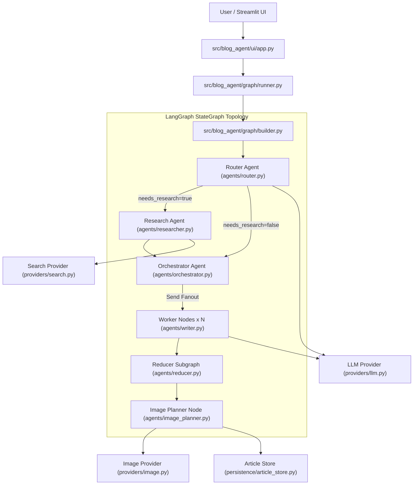

# BlogAgent Architecture & Layer Boundaries

## Overview
BlogAgent is an autonomous multi-agent content generation platform built using **LangGraph**, **Google Gemini 3.5 Flash Lite**, **Tavily Web Search**, and **Streamlit**.

The repository uses a clean, production-level, modular architecture that enforces strict separation of concerns, dependency inversion, and provider isolation.

---

## High-Level Component Diagram

---

## Layer Responsibilities

| Layer Directory | Primary Responsibility | Dependencies |
| :--- | :--- | :--- |
| `src/blog_agent/config/` | Environment variables, API keys, model names, directory paths. | `dotenv`, `os` |
| `src/blog_agent/domain/` | Pydantic Schemas (`Plan`, `Task`, `RouterDecision`) and LangGraph State (`BlogState`). | `pydantic` |
| `src/blog_agent/prompts/` | Prompt template strings isolated from Python execution logic. | None |
| `src/blog_agent/providers/` | Wrappers for external APIs (`get_text_llm`, `tavily_search`, `gemini_generate_image_bytes`). | `langchain_google_genai`, `google-genai` |
| `src/blog_agent/agents/` | Pure agent/node logic functions (`router_node`, `research_node`, `worker_node`). | `domain`, `prompts`, `providers` |
| `src/blog_agent/graph/` | LangGraph `StateGraph` topology construction, edges, `Send` fanout, and stream runner. | `langgraph`, `agents` |
| `src/blog_agent/persistence/` | File I/O for saving markdown documents and scanning local past blogs. | `pathlib` |
| `src/blog_agent/utils/` | Reusable utilities (`_message_text`, `safe_slug`, `bundle_zip`). | Standard Python, `streamlit` |
| `src/blog_agent/ui/` | Streamlit user interface components, glassmorphism theme, and session state manager. | `streamlit`, `graph`, `persistence` |

---

## Dependency Rules

1. **Downward Imports Only**: UI imports Graph → Graph imports Agents → Agents import Domain/Providers/Prompts.
2. **Domain Isolation**: `domain/schemas.py` and `domain/state.py` do NOT import Streamlit or external APIs.
3. **Provider Isolation**: Agents call provider functions (`get_text_llm()`, `tavily_search()`) rather than directly instantiating SDK clients inside node logic.
